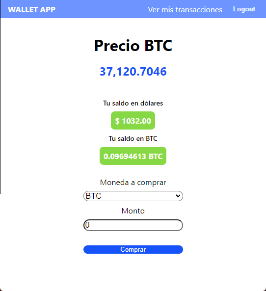

# Wallet App

React-Redux app that allows user to create an account, log in, make BTC-Dollar / Dollar-BTC transactions and see a full history of all transactions made. All this with the actual BTC price in real time using an integrated [Ruby on Rails API](https://github.com/karmaester/wallet-api)



## Live Demo

[Live version](https://karmaester-wallet-frontend.herokuapp.com/)

## Built With

- React
- Redux
- Sass

## Getting Started

To get a local copy up and running follow these simple example steps.

### Setup

- Open the console
- Download or git clone git@github.com:karmaester/WalletFrontend.git
- cd WalletFrontend

Install Node and npm:

```
  sudo apt install nodejs
  sudo apt install npm
```

Run the following commands

```
   npm run start
```

## Author

👤 **Khristian Rojas**

- [Github](https://github.com/karmaester)
- [Linkedin](https://www.linkedin.com/in/khristian-rojas/)

## 🤝 Contributing

Contributions, issues and feature requests are welcome!

Feel free to check the [issues page](https://github.com/karmaester/WalletFrontend/issues).

## Show your support

Give a ⭐️ if you like this project!


## 📝 License

This project is [MIT](https://opensource.org/licenses/MIT) licensed.
